# AI-Powered IT Help Desk Ticketing System

## Overview

This project is a fully functional IT Help Desk Ticketing System built from scratch using Python and Flask. The system allows users to submit IT support tickets through a web interface, where an intelligent backend automatically categorizes each ticket by issue type, assigns a priority level based on the urgency of the request, and generates a suggested fix for the technician. Upon submission, the system produces an AI-generated support email addressed to the user confirming receipt of their ticket and providing an estimated resolution time. A live dashboard displays real-time statistics, interactive charts, and the full ticket queue with search and filter functionality. This project demonstrates practical Help Desk skills combined with Python development, web application design, and automated workflow logic.

---

## Tools and Technologies

| Tool / Technology | Purpose |
|---|---|
| Python 3 | Core backend programming language |
| Flask | Web framework for routing and server logic |
| HTML / CSS | Frontend interface and styling |
| JSON | Local data storage for ticket records |
| Chart.js | Interactive donut and bar charts on dashboard |
| VS Code | Development environment |
| GitHub | Version control and project hosting |

---

## Features

- **Auto-Categorization** — Analyzed ticket descriptions using keyword detection to automatically classify issues as Network, Hardware, Software, Account Access, or General
- **Auto-Priority Assignment** — Assigned High, Medium, or Low priority based on urgency keywords found in the ticket description
- **Solution Suggester** — Generated a recommended fix for each ticket based on its category
- **AI-Generated Support Email** — Produced a personalized email response upon ticket submission, including estimated resolution time based on issue type
- **Live Dashboard** — Displayed real-time stats including Total Tickets, Open Tickets, Resolved Tickets, High Priority count, and Most Common Category
- **Interactive Charts** — Rendered a donut chart showing ticket distribution by category and a bar chart showing tickets by priority level
- **Search Functionality** — Enabled live filtering of tickets by name, email, or issue description
- **Filter Dropdowns** — Filtered the ticket queue by Category, Priority, and Status simultaneously
- **Ticket Detail Page** — Displayed full ticket information including all metadata, suggested fix, and the auto-generated support email
- **Mark Resolved** — Updated ticket status to Resolved and recorded the exact resolution timestamp
- **Delete Ticket** — Removed tickets from the system with a confirmation prompt
- **High Priority Highlighting** — Visually flagged High priority tickets with a red left border in the dashboard

---

## Project Walkthrough

1. A user navigates to the Submit Ticket page and fills out their name, email, and a description of their IT issue
2. Upon submission, the backend analyzed the description and automatically assigned a category, priority level, and suggested fix
3. An AI-generated support email was created and attached to the ticket, personalized with the user's name and tailored to their specific issue type
4. The user was redirected to the dashboard where the new ticket appeared in the queue with all relevant tags visible
5. The dashboard updated in real time to reflect the new ticket count, open ticket count, high priority count, most common category, and both charts
6. A technician could search for any ticket by name, email, or keyword, or filter the queue by category, priority, or status
7. Clicking a ticket name opened the full Ticket Detail page showing all submitted information, the suggested fix, and the auto-generated support email
8. The technician clicked Mark Resolved to close the ticket, which recorded the resolved timestamp and updated the dashboard stats instantly
9. Tickets could be permanently deleted from the system through the Delete button on the detail page

---

## Key Skills Demonstrated

- Built a full-stack web application using Python and Flask with no prior Python experience
- Designed and implemented automated ticket triage logic including categorization, priority assignment, and solution generation
- Developed an AI-powered email generation system that produces personalized responses based on ticket data
- Created a real-time dashboard with live statistics and interactive data visualizations using Chart.js
- Implemented search and multi-filter functionality for efficient ticket queue management
- Structured a clean RESTful routing system in Flask handling GET and POST requests across multiple pages
- Managed persistent data storage using JSON with full create, read, update, and delete operations
- Designed a professional user interface with consistent styling, color-coded priority indicators, and responsive layout

---

## Screenshots

### 01 — VS Code Project Structure (Bottom of app.py)
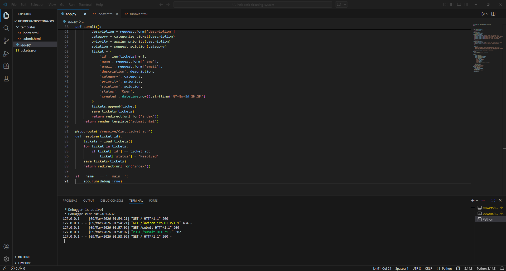
The Flask application backend showing the route handlers for ticket submission, resolution, deletion, and the ticket detail page.

### 02 — VS Code Project Structure (Top of app.py)
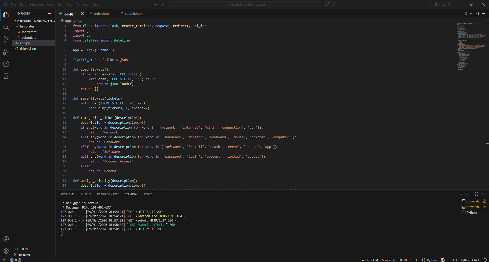
The top of app.py showing the auto-categorization, priority assignment, solution suggester, and auto-reply generation functions.

### 03 — Submit Ticket Form (Filled)
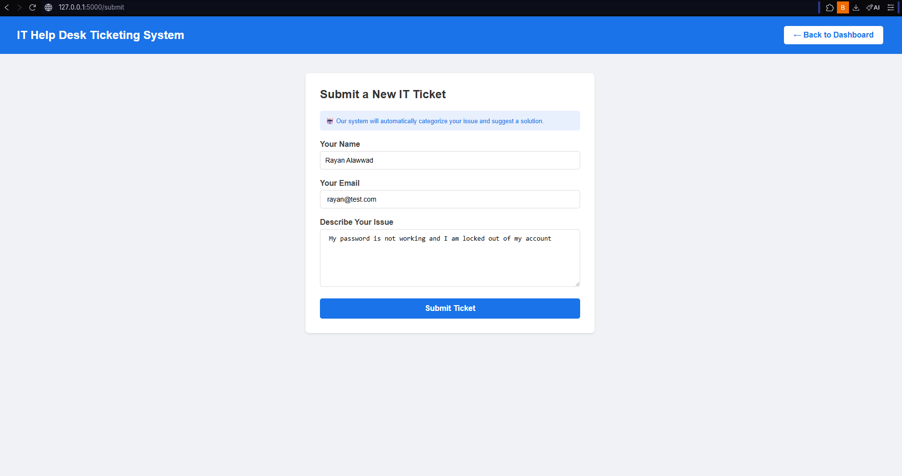
The ticket submission form filled out with a user's name, email, and IT issue description ready for processing.

### 04 — Dashboard After First Ticket Submitted
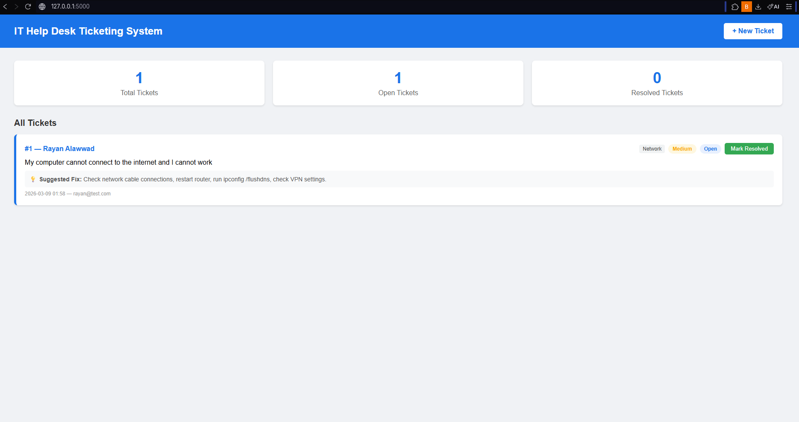
The dashboard updating in real time after the first ticket was submitted, showing live stats and the ticket in the queue.

### 05 — Dashboard After Ticket Resolved
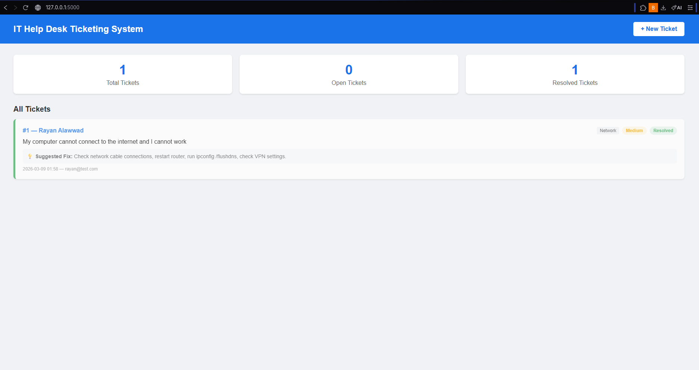
The dashboard reflecting the resolved status after the Mark Resolved button was clicked, with updated Open and Resolved counts.

### 06 — Submit Ticket Form (Empty)
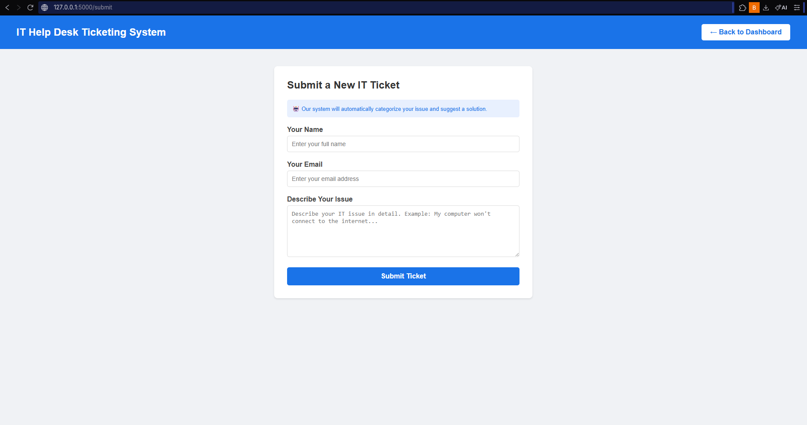
The clean ticket submission form with placeholder text guiding users through the input fields.

### 07 — Dashboard with Five Stat Cards
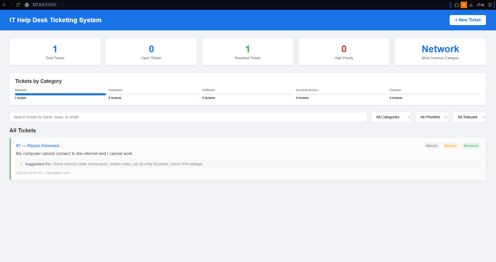
The full dashboard displaying all five stat cards including Total Tickets, Open Tickets, Resolved Tickets, High Priority, and Most Common Category.

### 08 — Dashboard with Five Tickets Across All Categories
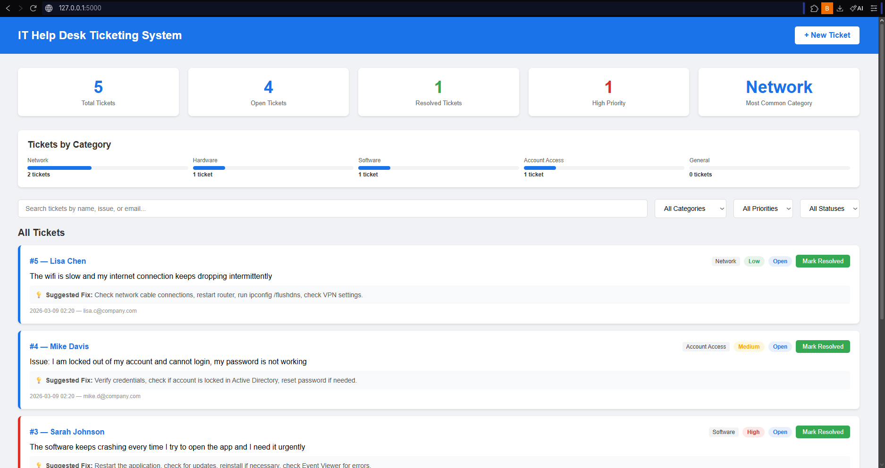
The ticket queue populated with five tickets spanning all categories, demonstrating the auto-categorization and priority assignment system.

### 09 — Search Feature Demo
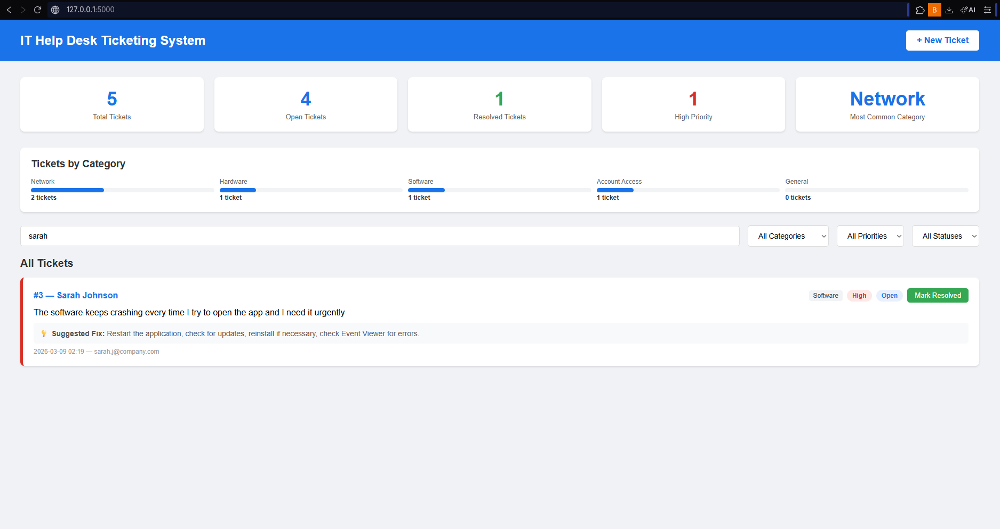
The live search filtering the ticket queue to display only the ticket matching the search term, demonstrating real-time search functionality.

### 10 — Filter by High Priority
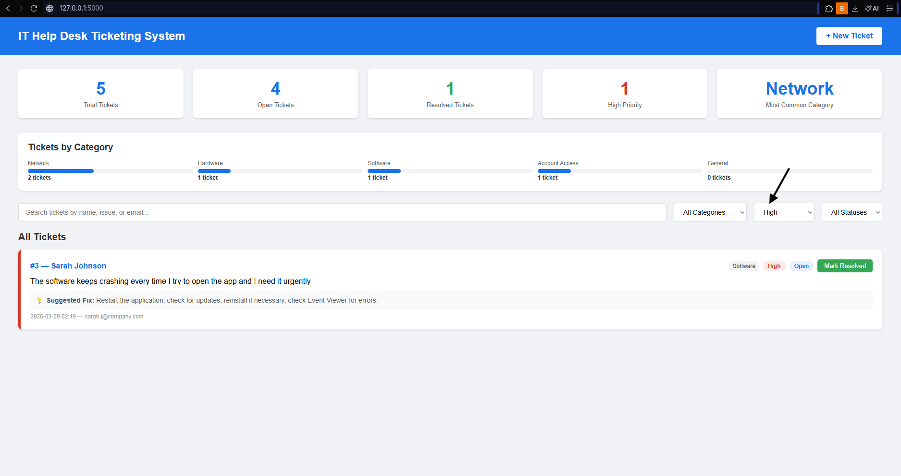
The filter dropdown set to High Priority, displaying only the critical tickets in the queue.

### 11 — Ticket Detail Page
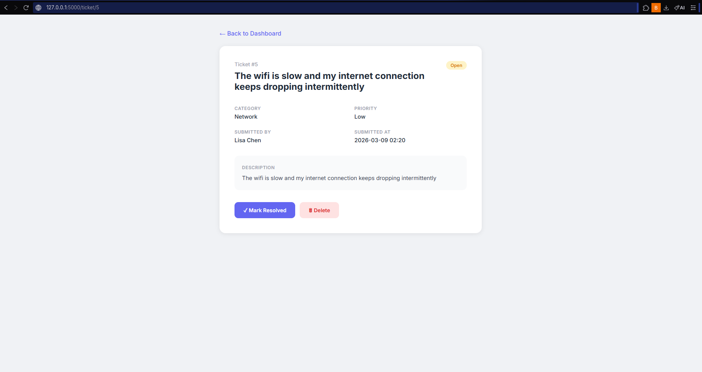
The full ticket detail page displaying all submitted information, the AI-suggested fix, and the action buttons for resolving or deleting the ticket.

### 12 — Dashboard with Resolved Ticket
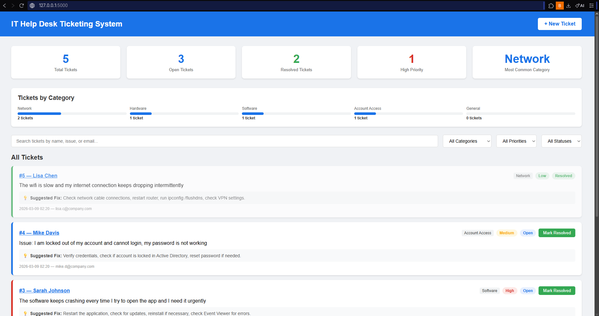
The dashboard after a ticket was marked resolved, showing the updated stat counts and the ticket displaying a Resolved badge.

### 13 — Dashboard with Search and Filters
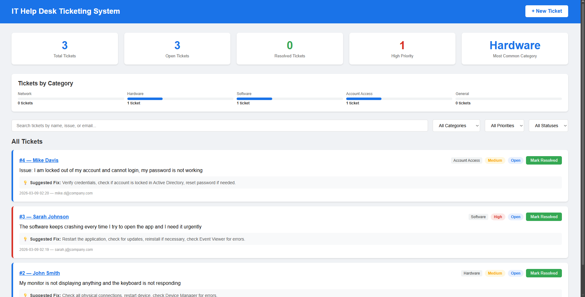
The dashboard showing the search bar and filter dropdowns in use simultaneously to narrow the ticket queue.

### 14 — Dashboard with Donut and Bar Charts
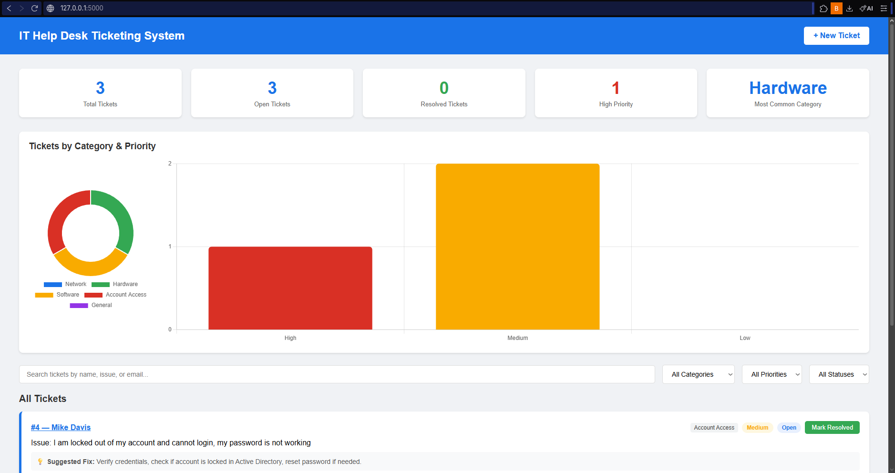
The upgraded dashboard displaying both the donut chart for category distribution and the bar chart for tickets by priority level side by side.

### 15 — Donut Chart Hover Tooltip
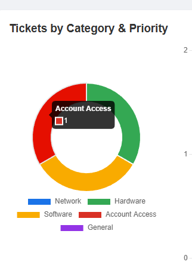
The interactive donut chart showing a hover tooltip with the category name and ticket count on mouseover.

### 16 — Full Ticket List All Categories
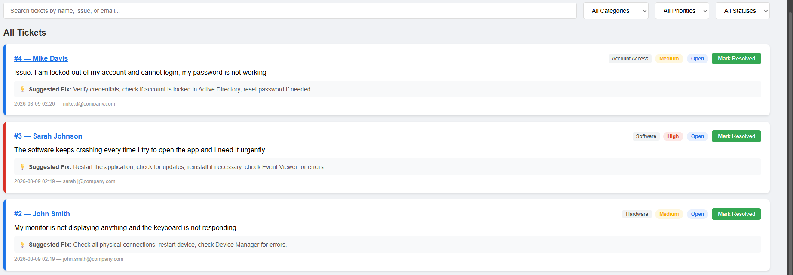
The complete ticket queue displaying tickets across multiple categories with color-coded priority badges and suggested fixes visible.

### 17 — Dashboard with New Ticket (Session 5)
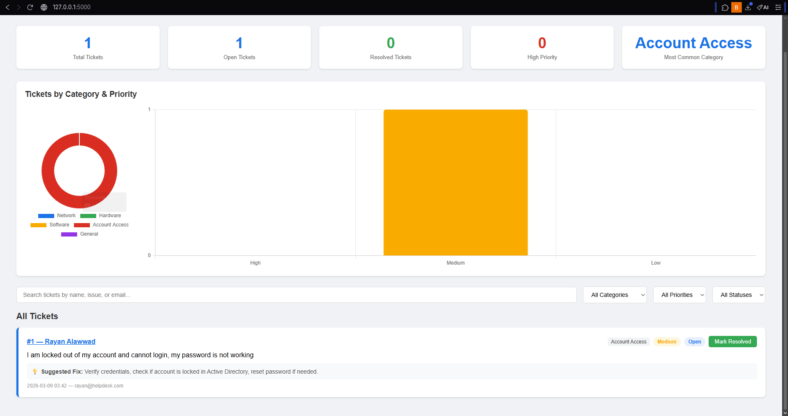
The dashboard after a new ticket was submitted in Session 5, showing the auto-generated category and priority assignment working correctly.

### 18 — Ticket Detail Page with Auto-Reply Visible
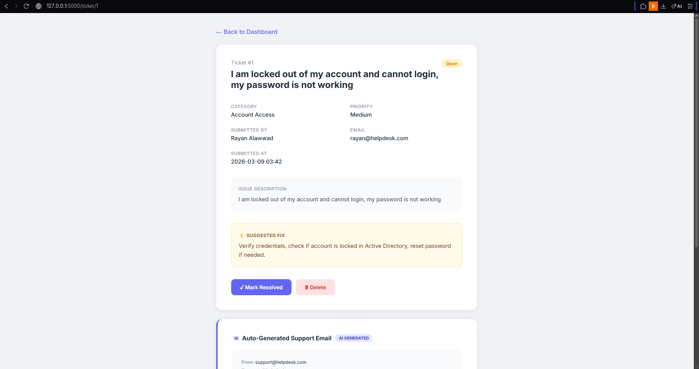
The ticket detail page showing both the full ticket information card and the AI Generated support email card below it.

### 19 — Auto-Generated Support Email
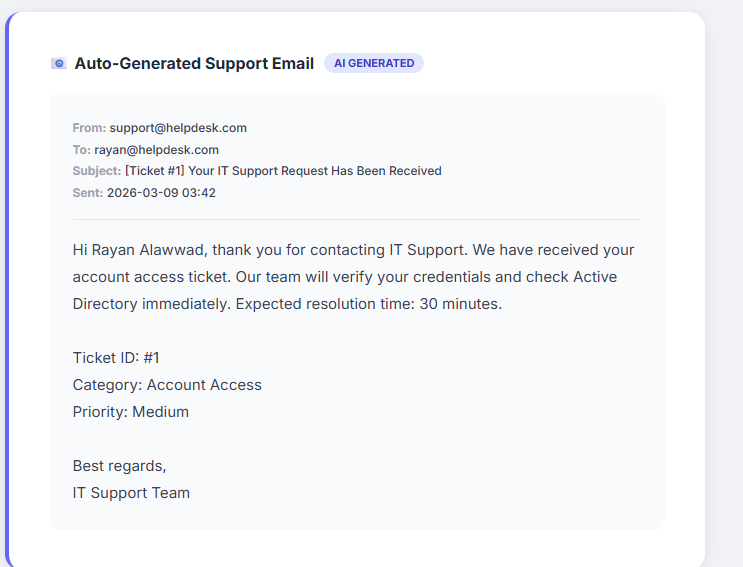
The AI-generated support email displaying the personalized message, ticket metadata, and estimated resolution time sent automatically upon ticket submission.
